# 🎨 SAPBA Diagram Style Catalog

Berikut **8 tema warna** yang tersedia untuk diagram Mermaid di SAPBA.

## Cara Penggunaan

Ketik `/diagram-styled` di Open WebUI, lalu isi:
- **topik**: Topik diagram yang diinginkan
- **style**: Nama tema (contoh: `ocean`, `galaxy`, `rainbow`)

---

## 🌊 1. Ocean Blue (`ocean`)
Profesional, tenang — cocok untuk **jaringan & teknologi**.

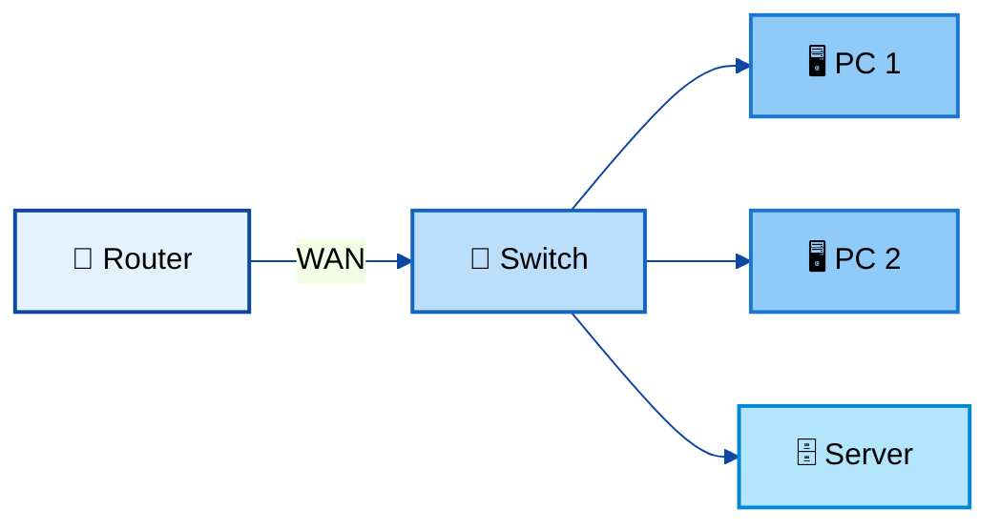

---

## 🌿 2. Forest Green (`forest`)
Natural, segar — cocok untuk **biologi & lingkungan**.

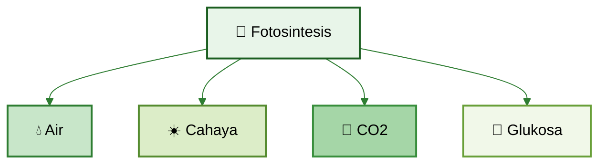

---

## 🌅 3. Sunset Warm (`sunset`)
Hangat, energik — cocok untuk **proses & alur kerja**.

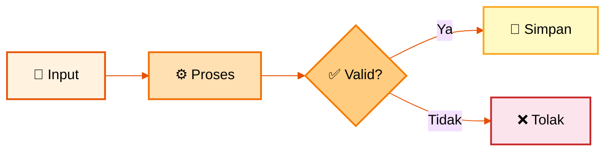

---

## 🔮 4. Purple Galaxy (`galaxy`)
Elegan, modern — cocok untuk **arsitektur & sistem**.

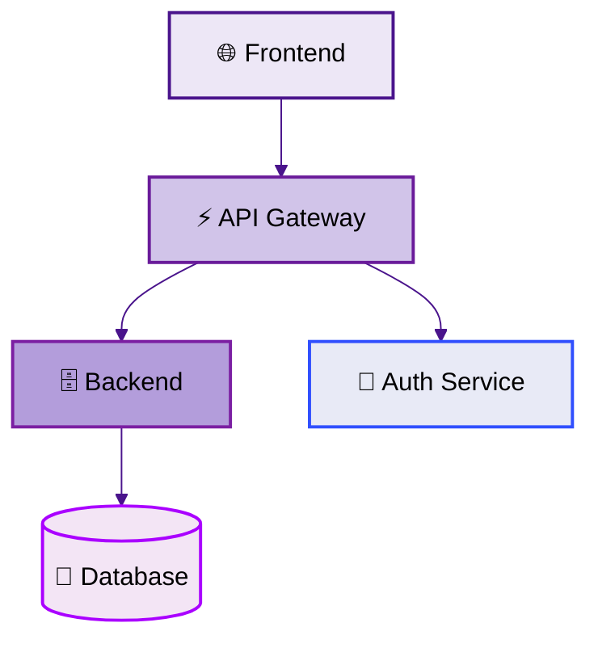

---

## 🏢 5. Corporate (`corporate`)
Formal, rapi — cocok untuk **presentasi bisnis & proposal**.

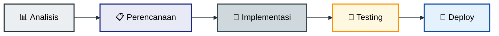

---

## 🌈 6. Pastel Rainbow (`rainbow`)
Berwarna, ceria — cocok untuk **edukasi & layer/tingkat**.

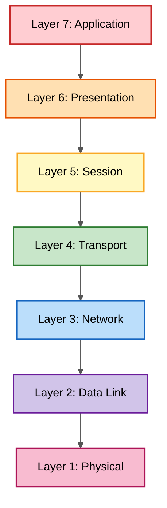

---

## 🖤 7. Monochrome (`mono`)
Minimalis, bersih — cocok untuk **dokumen formal & cetak**.

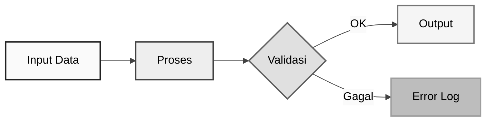

---

## 🍬 8. Candy Pop (`candy`)
Ceria, playful — cocok untuk **infografis & media sosial**.

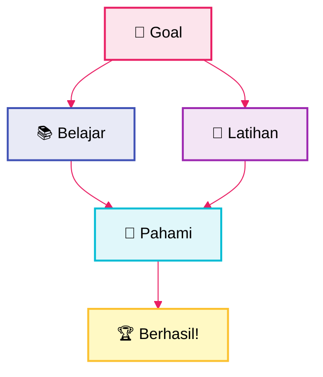

## 🌋 9. Volcano (`volcano`)
Dark Red, berani — cocok untuk **keamanan & peringatan**.

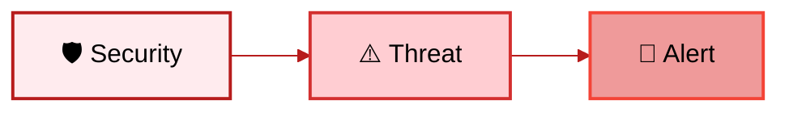

---

## 🌻 10. Sunflower (`sunflower`)
Bright Yellow, cerah — cocok untuk **ideasi & brainstorming**.

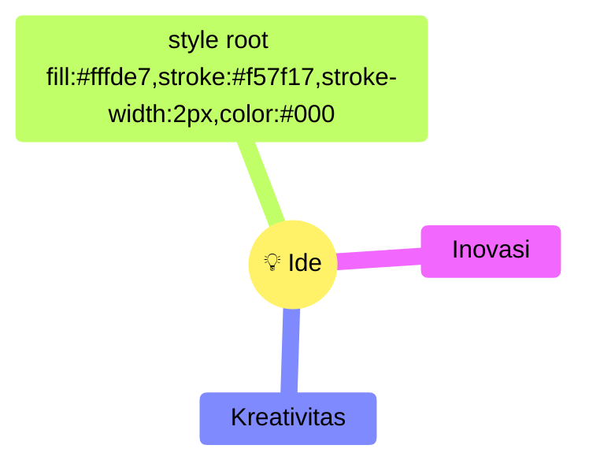

---

## ☕ 11. Coffee (`coffee`)
Brown Warm, klasik — cocok untuk **sejarah & struktur**.

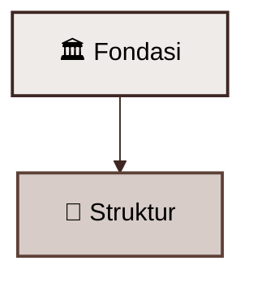

---

## 🧊 12. Ice (`ice`)
Cool Cyan, segar — cocok untuk **data & analitik**.

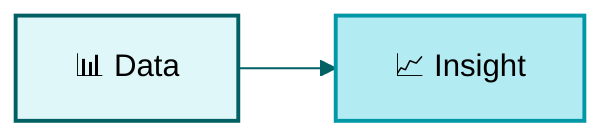

---

## Quick Reference

| Tema | Keyword | Cocok Untuk |
|------|---------|-------------|
| 🌊 Ocean Blue | `ocean` | Jaringan, Teknologi |
| 🌿 Forest Green | `forest` | Biologi, Lingkungan |
| 🌅 Sunset Warm | `sunset` | Proses, Alur Kerja |
| 🔮 Purple Galaxy | `galaxy` | Arsitektur, Sistem |
| 🏢 Corporate | `corporate` | Bisnis, Proposal |
| 🌈 Pastel Rainbow | `rainbow` | Edukasi, Layer |
| 🖤 Monochrome | `mono` | Dokumen Formal |
| 🍬 Candy Pop | `candy` | Infografis, Fun |
| 🌋 Volcano | `volcano` | Keamanan, Peringatan |
| 🌻 Sunflower | `sunflower` | Ideasi, Brainstorming |
| ☕ Coffee | `coffee` | Sejarah, Struktur Klasik |
| 🧊 Ice | `ice` | Data, Analitik |
